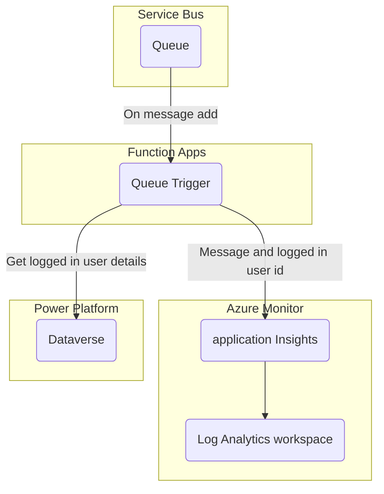

    <h1 align="center">
        Azure Developer CLI Template - rpothin/servicebus-csharp-function-dataverse
    </h1>
    <h3 align="center">
        Application to process messages from an Azure Service Bus to a Dataverse environment through a C# Azure Functions application using the Microsoft.PowerPlatform.Dataverse.Client package.
    </h3>

    
    
    

    
    
    

<h3 align="center">
  <a href="https://github.com/rpothin/servicebus-csharp-function-dataverse/discussions?discussions_q=category%3AIdeas">Feature request</a>
   · 
  <a href="https://github.com/rpothin/servicebus-csharp-function-dataverse/issues/new?assignees=rpothin&labels=bug%2Ctriage&template=BUG.yml&title=%5BBug%5D+%3CTitle%3E">Report a bug</a>
   · 
  <a href="https://github.com/rpothin/servicebus-csharp-function-dataverse/discussions/categories/q-a">Support Q&A</a>
</h3>

## 📢 What is the servicebus-csharp-function-dataverse project?

It is a GitHub repository using the [**Azure Developer CLI**](https://learn.microsoft.com/en-us/azure/developer/azure-developer-cli/overview) to get you up and running on Azure quickly in a scenario where you need to process messages from an Azure Service Bus to a Dataverse environment through a C# Azure Functions app.

It contains components (infrastructure as code in Bicep, C# Azure Functions application code...) that will help you be up and running quickly.

## 📖 Documentation

1. [Prerequisites for deploying the solution](./docs/00-Prerequisites.md)
2. [Setup and deployment of the solution](./docs/01-Quickstart.md)
3. [Test the deployed solution](./docs/02-TestTheSolution.md)
4. [GitHub configuration](./docs/03-GitHubConfiguration.md)

### Annex

- [Custom environment variables](./docs/A2-CustomEnvironmentVariables.md)

### Architecture

## ❗ Code of Conduct

I, **Raphael Pothin** ([@rpothin](https://github.com/rpothin)), as creator of this project, am dedicated to providing a welcoming, diverse, and harrassment-free experience for everyone.
I expect everyone visiting or participating in this project to abide by the following [**Code of Conduct**](CODE_OF_CONDUCT.md).
Please read it.

## 👐 Contributing to this project

From opening a bug report to creating a pull request: every contribution is appreciated and welcomed.
For more information, see [CONTRIBUTING.md](CONTRIBUTING.md)

### Not Sure Where to Start?

If you want to participate to this project, but you are not sure how you can do it, do not hesitate to contact [@rpothin](https://github.com/rpothin):

- By email at **raphael.pothin@gmail.com**
- On [Twitter](https://twitter.com/RaphaelPothin)

## 📝 License

All files in this repository are subject to the [MIT](LICENSE) license.

## 💡 Inspiration

We would like to thank the open-source projects below that helped us find some ideas on how to organize this project.

- [Azure-Samples/todo-csharp-cosmos-sql](https://github.com/Azure-Samples/todo-csharp-cosmos-sql) & all the other [great Azure Developer CLI templates](https://azure.github.io/awesome-azd/)
- [Gordonby/servicebus-dotnet-functionapp](https://github.com/Gordonby/servicebus-dotnet-functionapp)
