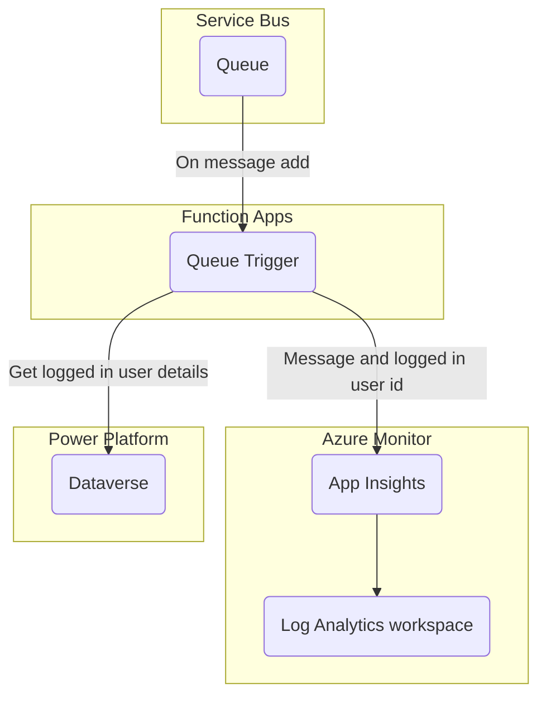

<p align="center">
    <h1 align="center">
        Azure Developer CLI Template - rpothin/servicebus-csharp-function-dataverse
    </h1>
    <h3 align="center">
        Application to process messages from an Azure Service Bus to a Dataverse environment through a C# Azure Functions app using the Microsoft.PowerPlatform.Dataverse.Client package.
    </h3>
</p>

<p align="center">
    <a href="https://github.com/rpothin/servicebus-csharp-function-dataverse/blob/main/LICENSE" alt="Repository License">
        </a>
    <a href="https://github.com/rpothin/servicebus-csharp-function-dataverse/issues" alt="Open Issues">
        </a>
    <a href="https://github.com/rpothin/servicebus-csharp-function-dataverse/pulls" alt="Open Pull Requests">
        </a>
</p>

<p align="center">
    <a href="#watchers" alt="Watchers">
        </a>
    <a href="#forks" alt="Forks">
        </a>
    <a href="#stars" alt="Stars">
        </a>
</p>

<h3 align="center">
  <a href="https://github.com/rpothin/servicebus-csharp-function-dataverse/discussions?discussions_q=category%3AIdeas">Feature request</a>
  <span> · </span>
  <a href="https://github.com/rpothin/servicebus-csharp-function-dataverse/issues/new?assignees=rpothin&labels=bug">Report a bug</a>
  <span> · </span>
  <a href="https://github.com/rpothin/servicebus-csharp-function-dataverse/discussions/categories/q-a">Support Q&A</a>
</h3>

## 📢 What is the servicebus-csharp-function-dataverse project?

It is a GitHub repository using the [**Azure Developer CLI**](https://learn.microsoft.com/en-us/azure/developer/azure-developer-cli/overview) to get you up and running on Azure quickly in a scenario where you need to process messages from an Azure Service Bus to a Dataverse environment through a C# Azure Functions app.

It contains components (GitHub workflows, infrastructure as code in Bicep, C# Azure Functions app code...) that will help you be up and running quickly.

## 📖 Documentation

### Prerequisites

The following prerequisites are required to use this application. Please ensure that you have them all installed locally.

- [Git (2.36.1+)](https://git-scm.com/)
- [GitHub CLI (v2.3+)](https://github.com/cli/cli)
- [Azure CLI (2.38.0+)](https://docs.microsoft.com/cli/azure/install-azure-cli)
- [Azure Developer CLI](https://aka.ms/azure-dev/install)
   - Windows:

```powershell
powershell -ex AllSigned -c "Invoke-RestMethod 'https://aka.ms/install-azd.ps1' | Invoke-Expression"
```

   - Linux/MacOS:

```powershell
curl -fsSL https://aka.ms/install-azd.sh | bash
```

- [.NET SDK 6.0](https://dotnet.microsoft.com/download/dotnet/6.0)

### Quickstart

The fastest way for you to get this application up and running on Azure is to use the `azd up` command. This single command will create and configure all necessary Azure resources - including access policies and roles for your account and service-to-service communication with Managed Identities.

1. Open a terminal, create a new empty folder, and change into it.
1. Run the following command to initialize the project, provision Azure resources, and deploy the application code.

```powershell
azd up --template rpothin/servicebus-csharp-function-dataverse
```

You will be prompted for the following information:

- `Environment Name`: This will be used as a prefix for the resource group that will be created to hold all Azure resources. This name should be unique within your Azure subscription.
- `Azure Location`: The Azure location where your resources will be deployed.
- `Azure Subscription`: The Azure Subscription where your resources will be deployed.

> NOTE: This may take a while to complete as it executes three commands: `azd init` (initializes environment), `azd provision` (provisions Azure resources), and `azd deploy` (deploys application code). You will see a progress indicator as it provisions and deploys your application.

When `azd up` is complete it will output the following URLs:

- Azure Portal link to view resources
- ToDo Web application frontend
- ToDo API application

### Architecture



## ❗ Code of Conduct

I, **Raphael Pothin** ([@rpothin](https://github.com/rpothin)), as creator of this project, am dedicated to providing a welcoming, diverse, and harrassment-free experience for everyone.
I expect everyone visiting or participating in this project to abide by the following [**Code of Conduct**](CODE_OF_CONDUCT.md).
Please read it.

## 👐 Contributing to this project

From opening a bug report to creating a pull request: every contribution is appreciated and welcomed.
For more information, see [CONTRIBUTING.md](CONTRIBUTING.md)

### Not Sure Where to Start?

If you want to participate to this project, but you are not sure how you can do it, do not hesitate to contact [@rpothin](https://github.com/rpothin):

- By email at **raphael.pothin@gmail.com**
- On [Twitter](https://twitter.com/RaphaelPothin)

## 📝 License

All files in this repository are subject to the [MIT](LICENSE) license.

## 💡 Inspiration

We would like to thank the open-source projects below that helped us find some ideas on how to organize this project.

- [Azure-Samples/todo-csharp-cosmos-sql](https://github.com/Azure-Samples/todo-csharp-cosmos-sql) & all the other great Azure Developer CLI templates in this organization
- [Gordonby/servicebus-dotnet-functionapp](https://github.com/Gordonby/servicebus-dotnet-functionapp)