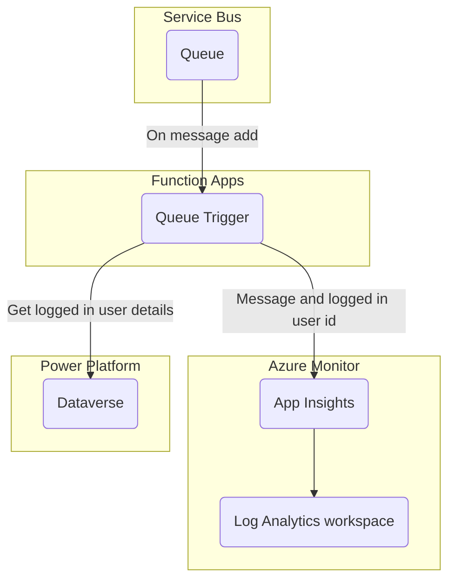

<p align="center">
    <h1 align="center">
        Azure Developer CLI Template - rpothin/servicebus-csharp-function-dataverse
    </h1>
    <h3 align="center">
        Application to process messages from an Azure Service Bus to a Dataverse environment through a C# Azure Functions app using the Microsoft.PowerPlatform.Dataverse.Client package.
    </h3>
</p>

<p align="center">
    <a href="https://github.com/rpothin/servicebus-csharp-function-dataverse/blob/main/LICENSE" alt="Repository License">
        </a>
    <a href="https://github.com/rpothin/servicebus-csharp-function-dataverse/issues" alt="Open Issues">
        </a>
    <a href="https://github.com/rpothin/servicebus-csharp-function-dataverse/pulls" alt="Open Pull Requests">
        </a>
</p>

<p align="center">
    <a href="#watchers" alt="Watchers">
        </a>
    <a href="#forks" alt="Forks">
        </a>
    <a href="#stars" alt="Stars">
        </a>
</p>

<h3 align="center">
  <a href="https://github.com/rpothin/servicebus-csharp-function-dataverse/discussions?discussions_q=category%3AIdeas">Feature request</a>
  <span> · </span>
  <a href="https://github.com/rpothin/servicebus-csharp-function-dataverse/issues/new?assignees=rpothin&labels=bug">Report a bug</a>
  <span> · </span>
  <a href="https://github.com/rpothin/servicebus-csharp-function-dataverse/discussions/categories/q-a">Support Q&A</a>
</h3>

## 📢 What is the servicebus-csharp-function-dataverse project?

It is a GitHub repository using the [**Azure Developer CLI**](https://learn.microsoft.com/en-us/azure/developer/azure-developer-cli/overview) to get you up and running on Azure quickly in a scenario where you need to process messages from an Azure Service Bus to a Dataverse environment through a C# Azure Functions app.

It contains components (GitHub workflow, Azure DevOps pipeline, infrastructure as code in Bicep, C# Azure Functions app code...) that will help you be up and running quickly.

## 📖 Documentation

### Prerequisites

#### Azure

The following prerequisites are required to use this solution. Please ensure that you have them all installed locally.

- [Git (2.36.1+)](https://git-scm.com/)
- [GitHub CLI (v2.3+)](https://github.com/cli/cli)
- [Azure CLI (2.38.0+)](https://docs.microsoft.com/cli/azure/install-azure-cli)
- [Azure Developer CLI](https://aka.ms/azure-dev/install)

```powershell
# For Windows
powershell -ex AllSigned -c "Invoke-RestMethod 'https://aka.ms/install-azd.ps1' | Invoke-Expression"

# For Linux/MacOS
curl -fsSL https://aka.ms/install-azd.sh | bash
```

- [.NET SDK 6.0](https://dotnet.microsoft.com/download/dotnet/6.0) - _for the Azure Functions app code_

You will also need an Azure account with an active subscription (_you can also [create one for free](https://azure.microsoft.com/free/?WT.mc_id=A261C142F) to start exploring_).

#### Dataverse

First you will need to have a Dataverse / Power Platform environment. To do that, you can choose one of the option below:
- [From the Power Platform Administration Center](https://learn.microsoft.com/en-us/power-platform/admin/create-environment#create-an-environment-with-a-database)
- [Using the Power Platform CLI](https://learn.microsoft.com/en-us/power-platform/developer/cli/reference/admin#pac-admin-create)
- [Starting free with a Power Apps Developer Plan](https://powerapps.microsoft.com/en-us/developerplan/)

> **Note**
> You will need the URL of your Dataverse / Power Platform environment in the configuration of some custom environment variables.

Then you will need to configure an application user on your environment by:
1. [Register an application in Azure AD](https://learn.microsoft.com/en-us/azure/active-directory/develop/quickstart-register-app#register-an-application)
2. [Add a client secret to your Azure AD app registration](https://learn.microsoft.com/en-us/azure/active-directory/develop/quickstart-register-app#add-a-client-secret)
3. [Add you Azure AD app registration as an application user to your Dataverse / Power Platform environment](https://learn.microsoft.com/en-us/power-platform/admin/manage-application-users#create-an-application-user)

> **Note**
> You will need the Azure AD app registration client ID (*available in the `Overview` page*) and its client secret value in the configuration of some custom environment variables.

### Quickstart

The fastest way for you to get this application up and running on Azure is to follow the procedure below.

1. Open a terminal, create a new empty folder, and change into it
2. Run the following command to initialize the project

```powershell
azd init --template rpothin/servicebus-csharp-function-dataverse
```

You will be prompted for the following information:

- `Environment Name`: This will be used in the name of the the resource group and the resources that will be created in Azure. This name should be unique within your Azure subscription.
- `Azure Location`: The Azure location where your resources will be deployed.
- `Azure Subscription`: The Azure Subscription where your resources will be deployed.

3. Run the following command to set the required custom environment variables

```powershell
azd env set <key> <value>
```

| Key                     | Description                                                                                                                                            |
| ----------------------- | ------------------------------------------------------------------------------------------------------------------------------------------------------ |
| DATAVERSE_ENV_URL       | URL of the considered Dataverse / Power Platform environment                                                                                           |
| DATAVERSE_CLIENT_ID     | Client ID of the Azure AD app registration configured as an application user with permissions in the considered Dataverse / Power Platform environment |
| DATAVERSE_CLIENT_SECRET | Secret of the Azure AD app registration configured as an application user with permissions in the considered Dataverse / Power Platform environment    |

4. Run the following command to provision Azure resources, and deploy the application code

```powershell
azd up
```

> **Note**
> This may take a while to complete as it executes two commands: `azd provision` (provisions Azure resources) and `azd deploy` (deploys application code). You will see a progress indicator as it provisions and deploys your application.

When `azd up` is complete it will output the following URLs:

- Azure Portal link to view resources
- Azure Functions application

#### Test the solution

1. Push a message in the `dataverse-inbound` queue (_configured in the [**main.parameters.json**](./infra/main.parameters.json) file_) - for example, you can do it directly from the queue in Azure Portal using the [**Service Bus Explorer**](https://learn.microsoft.com/en-us/azure/service-bus-messaging/explorer) feature
2. In Application Insights, go to the **Transaction Search** page and check if you have the traces below:
   - `C# ServiceBus queue trigger function processed message`
   - `Logged on user id`

If you find the documented traces it means the solution provided in this template is working.

### Architecture




## ❗ Code of Conduct

I, **Raphael Pothin** ([@rpothin](https://github.com/rpothin)), as creator of this project, am dedicated to providing a welcoming, diverse, and harrassment-free experience for everyone.
I expect everyone visiting or participating in this project to abide by the following [**Code of Conduct**](CODE_OF_CONDUCT.md).
Please read it.

## 👐 Contributing to this project

From opening a bug report to creating a pull request: every contribution is appreciated and welcomed.
For more information, see [CONTRIBUTING.md](CONTRIBUTING.md)

### Not Sure Where to Start?

If you want to participate to this project, but you are not sure how you can do it, do not hesitate to contact [@rpothin](https://github.com/rpothin):

- By email at **raphael.pothin@gmail.com**
- On [Twitter](https://twitter.com/RaphaelPothin)

## 📝 License

All files in this repository are subject to the [MIT](LICENSE) license.

## 💡 Inspiration

We would like to thank the open-source projects below that helped us find some ideas on how to organize this project.

- [Azure-Samples/todo-csharp-cosmos-sql](https://github.com/Azure-Samples/todo-csharp-cosmos-sql) & all the other great Azure Developer CLI templates in this organization
- [Gordonby/servicebus-dotnet-functionapp](https://github.com/Gordonby/servicebus-dotnet-functionapp)
