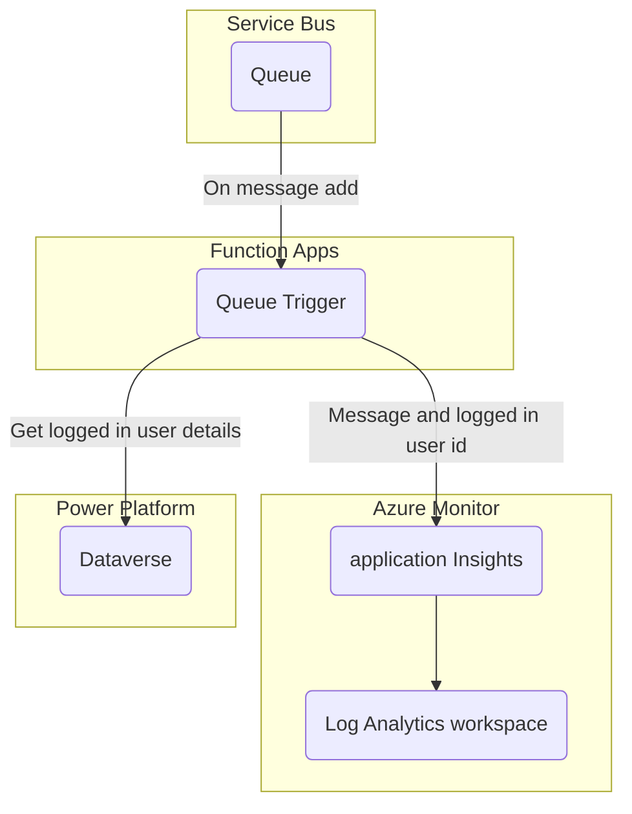

<p align="center">
    <h1 align="center">
        Azure Developer CLI Template - rpothin/servicebus-csharp-function-dataverse
    </h1>
    <h3 align="center">
        Application to process messages from an Azure Service Bus to a Dataverse environment through a C# Azure Functions application using the Microsoft.PowerPlatform.Dataverse.Client package.
    </h3>
</p>

<p align="center">
    <a href="https://github.com/rpothin/servicebus-csharp-function-dataverse/blob/main/LICENSE" alt="Repository License">
        </a>
    <a href="https://github.com/rpothin/servicebus-csharp-function-dataverse/issues" alt="Open Issues">
        </a>
    <a href="https://github.com/rpothin/servicebus-csharp-function-dataverse/pulls" alt="Open Pull Requests">
        </a>
</p>

<p align="center">
    <a href="#watchers" alt="Watchers">
        </a>
    <a href="#forks" alt="Forks">
        </a>
    <a href="#stars" alt="Stars">
        </a>
</p>

<h3 align="center">
  <a href="https://github.com/rpothin/servicebus-csharp-function-dataverse/discussions?discussions_q=category%3AIdeas">Feature request</a>
  <span> · </span>
  <a href="https://github.com/rpothin/servicebus-csharp-function-dataverse/issues/new?assignees=rpothin&labels=bug%2Ctriage&template=BUG.yml&title=%5BBug%5D+%3CTitle%3E">Report a bug</a>
  <span> · </span>
  <a href="https://github.com/rpothin/servicebus-csharp-function-dataverse/discussions/categories/q-a">Support Q&A</a>
</h3>

## 📢 What is the servicebus-csharp-function-dataverse project?

It is a GitHub repository using the [**Azure Developer CLI**](https://learn.microsoft.com/en-us/azure/developer/azure-developer-cli/overview) to get you up and running on Azure quickly in a scenario where you need to process messages from an Azure Service Bus to a Dataverse environment through a C# Azure Functions app.

It contains components (infrastructure as code in Bicep, C# Azure Functions application code...) that will help you be up and running quickly.

## 📖 Documentation

### Prerequisites

> **Note**
> If you plan to use a devcontainer definiton, like for [GitHub Codespaces](https://github.com/features/codespaces), the one included in this repository contains all the things you will need to start working with this template.

The following prerequisites are required to use this solution. Please ensure that you checked all these points before starting.

- [Git](https://git-scm.com/)
- [GitHub CLI (v2.3+)](https://github.com/cli/cli)
- [Azure CLI (2.38.0+)](https://docs.microsoft.com/cli/azure/install-azure-cli)
- [Azure Developer CLI](https://aka.ms/azure-dev/install)

```powershell
# For Windows
powershell -ex AllSigned -c "Invoke-RestMethod 'https://aka.ms/install-azd.ps1' | Invoke-Expression"

# For Linux/MacOS
curl -fsSL https://aka.ms/install-azd.sh | bash
```

- [.NET SDK 6.0](https://dotnet.microsoft.com/download/dotnet/6.0) - _for the Azure Functions application code_
- [Power Platform CLI](https://learn.microsoft.com/en-us/power-platform/developer/cli/introduction#install-microsoft-power-platform-cli) - _for the configuration of the Power Platform environment throught the execution of the [post-init-setup](./scripts/post-init-setup.ps1) PowerShell script_

> **Note**
> The configuration of the Azure and Power Platform parts can be done with 2 different accounts in 2 different tenants.

#### Azure

An account with:
- access to an active Azure subscription (_you can [create one for free](https://azure.microsoft.com/free/?WT.mc_id=A261C142F) if you don't have one yet_)
- the permission to create an application registrations in Azure AD (*for the management of the Azure deployment from GitHub*)

> **Note**
> To be able to configure the solution you will need at least the roles below on the considered Azure subscription:
> - [Contributor](https://learn.microsoft.com/en-us/azure/role-based-access-control/built-in-roles#contributor)
> - [User Access Administrator](https://learn.microsoft.com/en-us/azure/role-based-access-control/built-in-roles#user-access-administrator) - _for the configuration of the access of the Azure Functions application to the Azure Service Bus_

#### Power Platform

An account with:
- access to an existing Power Platform environment as an administrator **or** the permission to create a new Power Platform environment
- the permission to create an application registrations in Azure AD (*for the communication from the Azure Functions application to the Power Platform environment*)

> **Note**
> To explore the Power Platform part of this template you can use one of the following free ways:
> - [Power Apps Developer Plan](https://powerapps.microsoft.com/en-us/developerplan/)
> - [Microsoft 365 Developer Program](https://developer.microsoft.com/en-us/microsoft-365/dev-program)
> - [Dynamics 365 Free Trial](https://dynamics.microsoft.com/en-us/dynamics-365-free-trial/)

### Quickstart

[](https://youtu.be/rcVtA19GyeU)

The fastest way for you to get this application up and running on Azure is to follow the procedure below.

> **Note**
> In GitHub there is even a easier way than the one below:
> - From the [rpothin/servicebus-csharp-function-dataverse](https://github.com/rpothin/servicebus-csharp-function-dataverse) GitHub repository, click on the **Use this template** button
> - Select the **Open in a codespace** option
> - Go directly to the step 3 of this section

1. Open a terminal, create a new empty folder, and change into it
2. Run the following command to initialize the project

```powershell
azd init --template rpothin/servicebus-csharp-function-dataverse
```

You will be prompted for the following information:

- `Environment Name`: This will be used in the name of the the resource group and the resources that will be created in Azure. This name should be unique within your Azure subscription.
- `Azure Location`: The Azure location where your resources will be deployed.
- `Azure Subscription`: The Azure Subscription where your resources will be deployed.

3. Run the following command to finalize the initialization of the project

```powershell
# For Windows
.\scripts\post-init-setup.ps1

# For Linux/MacOS
pwsh scripts/post-init-setup.ps1

# You can add "-verbose" to get more details regarding the execution
```

> **Note**
> This PowerShell script will:
> - create an application registration in Azure AD for the Azure deployment from GitHub
> - create an application registration in Azure AD for the communication from the Azure Functions application to the Power Platform / Dataverse environment
> - offer to create a Power Platform / Dataverse environment based on the element in the [Dataverse environment configuration](./.dataverse/environment-configuration.json) file
> - register the second application registration created in Azure AD as an application user in the considered Power Platform / Dataverse environment

4. Run the following command to provision Azure resources, and deploy the application code

> **Note**
> If you use 2 different accounts for the configuration of the Azure and Power Platform part, you will need to connect again with your "Azure" account before running the following command. You can do that using the `az login --use-device-code` command.

```powershell
azd up
```

> **Note**
> This may take a while to complete as it executes two commands: `azd provision` (provisions Azure resources) and `azd deploy` (deploys application code). You will see a progress indicator as it provisions and deploys your application.

When `azd up` is complete it will output the following URLs:

- Azure Portal link to view resources
- Azure Functions application

#### Custom environment variables

| **Key**                          | **Description**                                                                                                                                                                                                                                                                                                                            |
| -------------------------------- | ------------------------------------------------------------------------------------------------------------------------------------------------------------------------------------------------------------------------------------------------------------------------------------------------------------------------------------------ |
| DATAVERSE_ENV_URL                | URL of the considered Dataverse / Power Platform environment configured in the Key Vault during Azure infrastructure deployment for the communication from the Azure Functions application to the Power Platform / Dataverse environment                                                                                                   |
| DATAVERSE_CLIENT_ID              | Client ID of the Azure AD application registration configured as an application user with permissions in the considered Dataverse / Power Platform environment configured in the Key Vault during Azure infrastructure deployment for the communication from the Azure Functions application to the Power Platform / Dataverse environment |
| DATAVERSE_CLIENT_SECRET          | Secret of the Azure AD application registration configured as an application user with permissions in the considered Dataverse / Power Platform environment configured in the Key Vault during Azure infrastructure deployment for the communication from the Azure Functions application to the Power Platform / Dataverse environment    |
| AZURE_SERVICE_PRINCIPAL_NAME     | Name of the application registration / service principal to manage Azure deployment from GitHub                                                                                                                                                                                                                                            |
| DATAVERSE_SERVICE_PRINCIPAL_NAME | Name of the application registration / service principal to manage the communication from the Azure Functions application to the Power Platform / Dataverse environment                                                                                                                                                                    |

#### Test the solution

[](https://youtu.be/FkhUpgTQiUY)

To test the solution, you can manually push a message in the `dataverse-inbound` queue (_configured in the [**main.parameters.json**](./infra/main.parameters.json) file_) - for example, you can do it directly from the queue in Azure Portal using the [**Service Bus Explorer**](https://learn.microsoft.com/en-us/azure/service-bus-messaging/explorer) feature.


To validate the consumption of the message you can:

- open the Azure Functions resource, go to the **ProcessServiceBusMessage** function and check the runs in the **Monitor** section


- open the Application Insights resource, go to the **Transaction Search**


In both places above you should see the traces below:

- `C# ServiceBus queue trigger function processed message`
- `Logged on user id`


If you find the documented traces it means the solution provided in this template is working.

### GitHub configuration

Follow the steps below to configure the elements required to run the GitHub workflow to provision the Azure resources and deploy the Azure Functions application code.

> **Note**
> The considered service principal will need to have the following permissions ont the considered Azure subscription:
> - [Contributor](https://learn.microsoft.com/en-us/azure/role-based-access-control/built-in-roles#contributor)
> - [User Access Administrator](https://learn.microsoft.com/en-us/azure/role-based-access-control/built-in-roles#user-access-administrator) - _for the configuration of the access of the Azure Functions application to the Azure Service Bus_

> **Note**
> If you ran the [**post-init-setup**](./scripts/post-init-setup.ps1) PowerShell script, you can considered the value of the `AZURE_SERVICE_PRINCIPAL_NAME` environment variable.

In your workspace linked to a GitHub repository execute the command below:

```powershell
azd pipeline config --auth-type federated --principal-name <service principal name>
```

> **Note**
> If you are in GitHub Codespaces you get an error like the following one: `Error: failed setting AZURE_CREDENTIALS secret: failed running gh secret set exit code: 1, stdout: , stderr: failed to fetch public key: HTTP 403: Resource not accessible by integration (https://api.github.com/repos/savannahostrowski/codespaces-test/actions/secrets/public-key)
: exit status 1`
> As a workaround, you can run the following commands in the Terminal:
> - `export GITHUB_TOKEN=` to unset GITHUB_TOKEN
> - `gh auth login` to log in to GitHub CLI (by default repo scope is included)

Set the actions secrets associated to the custom environment variables using the command below

```powershell
# Paste secret value for the current repository in an interactive prompt
gh secret set <secret name>
```

| **Secret Name**         | **Description**                                                                                                                                                                                                                                                                                                                            |
| ----------------------- | ------------------------------------------------------------------------------------------------------------------------------------------------------------------------------------------------------------------------------------------------------------------------------------------------------------------------------------------ |
| DATAVERSE_ENV_URL       | URL of the considered Dataverse / Power Platform environment configured in the Key Vault during Azure infrastructure deployment for the communication from the Azure Functions application to the Power Platform / Dataverse environment                                                                                                   |
| DATAVERSE_CLIENT_ID     | Client ID of the Azure AD application registration configured as an application user with permissions in the considered Dataverse / Power Platform environment configured in the Key Vault during Azure infrastructure deployment for the communication from the Azure Functions application to the Power Platform / Dataverse environment |
| DATAVERSE_CLIENT_SECRET | Secret of the Azure AD application registration configured as an application user with permissions in the considered Dataverse / Power Platform environment configured in the Key Vault during Azure infrastructure deployment for the communication from the Azure Functions application to the Power Platform / Dataverse environment    |

### Architecture




## ❗ Code of Conduct

I, **Raphael Pothin** ([@rpothin](https://github.com/rpothin)), as creator of this project, am dedicated to providing a welcoming, diverse, and harrassment-free experience for everyone.
I expect everyone visiting or participating in this project to abide by the following [**Code of Conduct**](CODE_OF_CONDUCT.md).
Please read it.

## 👐 Contributing to this project

From opening a bug report to creating a pull request: every contribution is appreciated and welcomed.
For more information, see [CONTRIBUTING.md](CONTRIBUTING.md)

### Not Sure Where to Start?

If you want to participate to this project, but you are not sure how you can do it, do not hesitate to contact [@rpothin](https://github.com/rpothin):

- By email at **raphael.pothin@gmail.com**
- On [Twitter](https://twitter.com/RaphaelPothin)

## 📝 License

All files in this repository are subject to the [MIT](LICENSE) license.

## 💡 Inspiration

We would like to thank the open-source projects below that helped us find some ideas on how to organize this project.

- [Azure-Samples/todo-csharp-cosmos-sql](https://github.com/Azure-Samples/todo-csharp-cosmos-sql) & all the other [great Azure Developer CLI templates](https://azure.github.io/awesome-azd/)
- [Gordonby/servicebus-dotnet-functionapp](https://github.com/Gordonby/servicebus-dotnet-functionapp)
