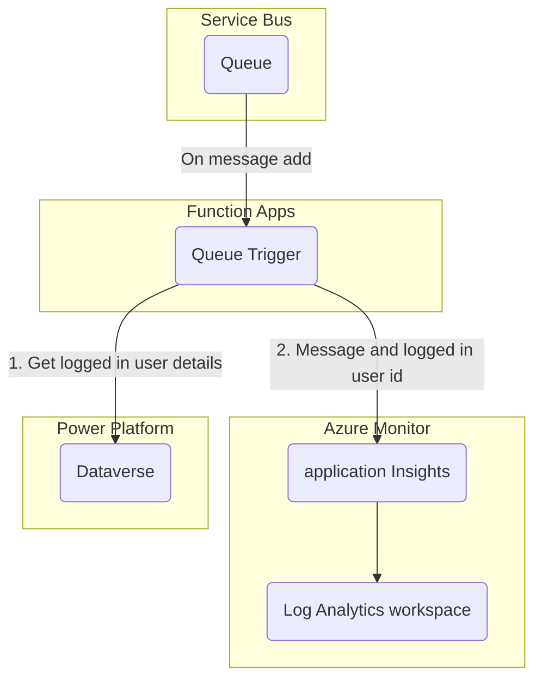

    <h1 align="center">
        Architecture of the solution
    </h1>

```mermaid
graph TB
    subgraph Function Apps
        sbTrigger
    end

    subgraph Service Bus
        sb(Queue)
        sb-->|On message add|sbTrigger(Queue Trigger)
    end

    subgraph Azure Monitor
        ai(application Insights)
        la(Log Analytics workspace)
        sbTrigger-->|2. Message and logged in user id|ai
        ai-->la
    end

    subgraph Power Platform
        dataverse(Dataverse)
        sbTrigger-->|1. Get logged in user details|dataverse
    end

```